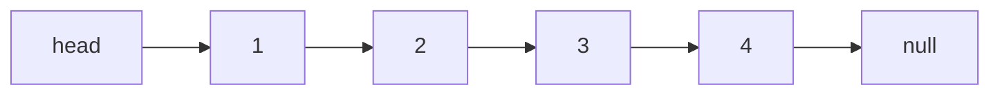

# Leetcode
Leetcode刷题
## 1. 大数乘法问题
   #### 思路:  char a[],char b[],int c[],int d[],int res[];
   #### (1) 使用两个字符数组去存储两个整数，然后用两个整型数组去接这个数据的每位的数据;
   #### (2) 最后再用一个整型数组去接这两个整形数组每个位置的计算结果, 具体的实现方式看代码;
   #### (3) 遍历结果判断, 如果第i位的结果 >= 10, res[i+1] += res[i] / 10; res[i] %= 10;
   #### (4) 否则就遍历下一位数据，直到所有的数据全部遍历完;
   #### (5) 最后的得到的结果进行一个前端0的处理工作，然后从后向前的打印出每一个位置的值;

   #### 具体细节的实现请参考源代码 bigNumber.c

### 1. 线性表
(1) 顺序存储结构，又称为随机存取结构  数组
(2) 链式存储结构，又称为顺序存取结构  链表、栈、队列

数组的存取可以通过下标去实现。
链表的存取需要遍历整个链表，找到对应的位置，然后插入或这取出元素。


#### 单链表的反转
(1) 迭代反转法, head是无头结点的头指针

设计三个指针分别指向NULL HEAD HEAD->NEXT, 然后用这三个指针一点一点向右遍历，将所有节点的指向全部反转过来

beg mid end

```c
Linklist *itertrator_reverse(Linklist *head)
{
    if (head == NULL || head->next == NULL) {
        printf("Linklist is NULL!!!\n");
        return head;
    }

    Linklist *beg = NULL;
    Linklist *mid = head;
    Linklist *end = head->next;

    while (1) {
        // 修改mid 节点的指向
        mid->next = beg;
        // mid 走到最后一个节点，end为NULL
        if (end == NULL) break;
        beg = mid;
        mid = end;
        end = end->next;
    }

    head = mid;
    return head;
}

```
(2) 递归反转法
设计思想与 (1) 相反, 从链表的尾部节点开始，向前遍历，改变各个节点的指向，即指向前一个节点



```c
Linklist *recurise_reverse(Linklist *head)
{
    if (head == NULL || head->next == NULL) {
        printf("Linklist is NULL or only onde node!!!\n");
        return head;
    }

    Linklist *new_head = recurise_reverse(head->next);
    head->next->next = head;
    head->next = NULL;

    return new_head;
}
```
当每次递归到53行的时候，递归都会深入一层，并依次指向节点2、3、4的指针作为实参参与递归。
根据递归的出口判断条件，当函数参数head指向的节点4满足head->next == NULL, 递归不再深入，并返回指向节点4的指针，
这个就是反转链表的新头节点。


(3) 就地逆置法


(4) 头插法


  
